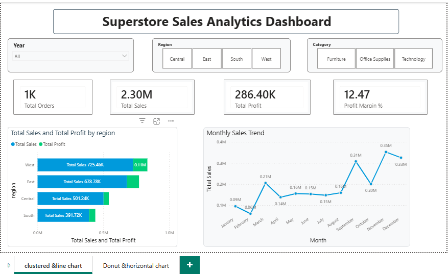

# 🏆 Superstore Sales Analytics Dashboard

## 📌 Project Overview
An end-to-end Data Analytics project analyzing 4 years of 
retail sales data to uncover business insights and build 
an executive-level interactive dashboard.

---

## 🎯 Business Problem
The sales manager needs answers to:
- Which regions and categories drive the most profit?
- Which products are losing money?
- How do discounts impact profitability?
- Who are our most valuable customers?

---

## 🛠️ Tools & Technologies
| Tool | Purpose |
|------|---------|
| Python (Pandas) | Data cleaning & analysis |
| Matplotlib & Seaborn | Data visualization |
| SQL (pandasql) | Business queries |
| Power BI | Interactive dashboard |

---

## 📁 Project Structure
superstore-sales-analytics/
├── data/                    # Raw and cleaned datasets
├── notebooks/               # Jupyter notebooks
│   ├── 01_exploration.ipynb
│   ├── 02_cleaning.ipynb
│   └── 03_analysis.ipynb
├── charts/                  # Generated visualizations
├── dashboard/               # Power BI dashboard file
└── screenshots/             # Dashboard preview images
---

## 📊 Dashboard Preview


---

## 🔍 Key Business Insights
1. 📍 **West region** generates highest profit ($108K)
2. 🖥️ **Technology** is the most profitable category (17% margin)
3. 🪑 **Tables & Bookcases** are loss-making sub-categories (-$17K)
4. 💸 **High discounts (>40%)** consistently lead to negative profit
5. 📈 **Q4 shows peak sales** — holiday season drives revenue

---

## 🚀 How to Run This Project
1. Clone the repository
```bash
git clone https://github.com/YOUR_USERNAME/superstore-sales-analytics.git
```
2. Install required libraries
```bash
pip install pandas matplotlib seaborn pandasql
```
3. Open notebooks in order (01 → 02 → 03)
4. Open `dashboard/superstore_dashboard.pbix` in Power BI Desktop

---

## 📬 Connect With Me
- LinkedIn: [Your LinkedIn URL]
- Email: your.email@gmail.com
